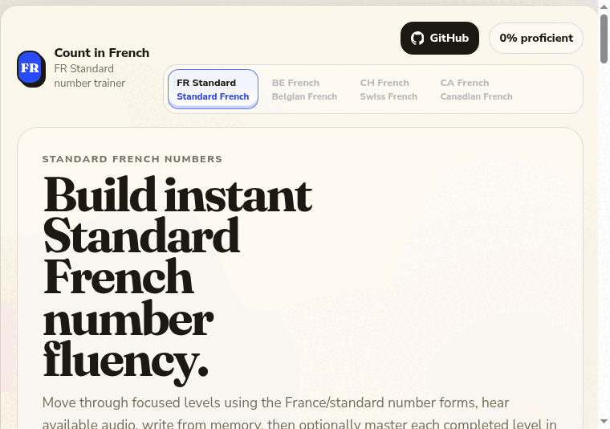

# Count in French: French Number Practice

Learn French numbers from 1 through billions with short lessons, audio practice, recall drills, and review.

Open the app: https://icey-max.github.io/count-in-french/

## What This Helps You Learn

Count in French is for beginners who want French numbers to feel automatic. It trains you to recognize numbers by sight, write them in French, understand them when you hear them, and remember the patterns behind the difficult ranges.

You will practice:

- Counting in French from 1 to 100, then forming hundreds, thousands, millions, and billions.
- Hearing a French number and typing the digits.
- Seeing digits and writing the French spelling.
- Remembering numbers you missed before.
- Understanding the 70s, 80s, 90s, hundreds, `mille`, `million`, and `milliard` patterns.

## Why French Numbers Need Practice

Some French numbers are straightforward, like `un`, `deux`, `trois`, and `dix`. Others use patterns that can surprise English speakers.

For example:

- 70 is `soixante-dix`, or sixty-ten.
- 80 is `quatre-vingts`, or four twenties.
- 90 is `quatre-vingt-dix`, or four-twenty-ten.

Later levels add the same kind of pattern practice for `cent`, `mille`, `million`, and `milliard`, so large numbers are built from reusable parts instead of memorized one by one.

## How To Use It

Start at Level 1 and move through the numbers in small groups. Each level introduces a range, then asks you to answer from memory. You will see digits, hear audio, type French spellings, and review mistakes until the numbers become easier to recall.

After you finish the levels, use mixed review and the final exam to check whether you can handle the full course deck without relying on the order of a lesson.

## What Makes It Useful

- Small lessons keep practice manageable.
- Audio prompts train listening, not just reading.
- Active recall makes you type answers instead of only recognizing them.
- Adaptive review brings missed numbers back into practice.
- The final exam checks the full course deck, including hundreds, thousands, millions, and billions.

## Privacy

The app runs in your browser. Your progress is saved locally on your device, and you do not need an account to use it.
